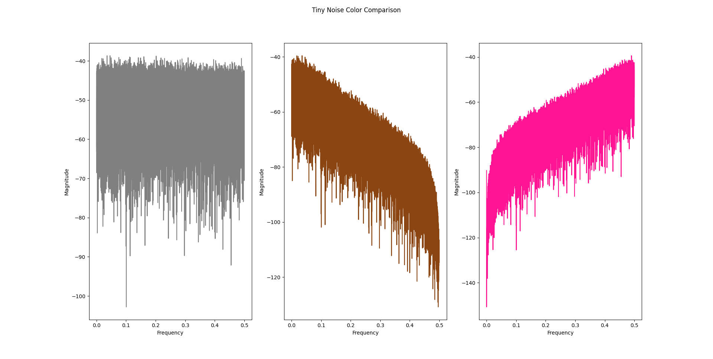

# TinyNoise

TinyNoise is an efficient fixed-point stochastic noise generator written in C, based on pseudo random numbers, with a very small footprint.

**Are ready to hear the noise? It is so tiny...**

## Donations

I believe in **free and open source software**! Help the OSS community by donating below:

[](https://www.paypal.com/donate/?hosted_button_id=AMFZ83MA4Z3RA)

## Overview

### Features

* Computationally and memory efficient algorithm 
* No math library used
* White, brown and pink noise options
* Unit tested using Unity

### Pseudo Random Number Generator Algorithm

The algorithm described below was designed by me. It was an effort to create a fix point, low footprint stochastic noise generator for integration on a low power DSP chip. This signal was used, after filtering, for tinnitus treatment.

#### Implementation

Random number generation with 16 bit variable
* Using 3 seeds
* Just 2 counters
* Only one multiplication, two additions and one shift operation
* Only 10 bytes need for RAM

1. Take a seed using the counter to select it. The counter is increased by 1 every loop. Here is an example of 3 seeds:

```
seeds = [65321,12043,2769]

val = seeds[seed_counter] = 65321 = 1111111100101001
```

2. Square the current value to get twice the size (in this example, from 16 bit to 32 bit).

```
val = val * val = 11111110010100101011010010010001
```

3. Crop the current sample based on the gama factor. Gama, same as seed counter, gets updated by 1 every loop, being that the maximum is the number of bits, this case 16 bits (0 to 15).

```
11111110010100101011010010010001
|     gama=0    |
 |     gama=1    |
  |     gama=2    |
            ...
               |     gama=15    |
```

For *gama = 0*, the output value will be *1111111001010010* or *65106*.

4. Next step is to update the seeds. Update the seed by adding the current value to the next seed. Hence, the output will be even more likely to imitate random behaviour. 

```
seeds[seed_counter] = val + seeds[seed_counter + 1]
```

For *seed_counter = 0*:

```
seeds[0]= 65106 + 12043 = 11613 = 0010110101011101
```

Note that the value above overflew and there is no problem with it for this algorithm.

5. The final step is to add the previous sample to the output.

```
output = val + prev_val
prev_val = val
```

Update the previous sample value too. For the first loop, *prev_val* is initialized to zero.

#### Results

##### Stochastic process
The algorithm above has a uniform distribution with flat spectral composition. Python's matplotlib was used for plotting the results of TinyNoise library. The 16 bit fixed-point values (Q15 format) were converted to floats using [PyFi](https://github.com/CesarPiresSevero/pyfi) library before plotting. 

The plot below shows the output of it for 100k samples:


For comparison, here is the output of Python's Numpy random uniform implementation:


##### Computational performance
The algorithm performance was benchmarked against C rand() function (included in stdlib). Execution time was measured based on one billion samples. The results below are an average of five measurements:

Implementation | Execution time
:---:|:---:
C rand | **22.93 seconds** 
TinyNoise | **5.35 seconds**

There are many factors that might affect the execution time. Therefore, the values above should be understood as an indication of computational performance.  

##### Repetition
The algorithm was tested for sequence repetition. The first 5 initial samples, based on default seeds, were compared against one billion samples.
It was found that the initial **sequence does not repeat itself** within one billion samples. It is very likely that there is no repetition whatsoever, but a much larger dataset would have to be used to confirm it.
The same test was performed on C rand() function. The results were the same as this algorithm, no repetition was found.

## Getting started

This section will go into detail about the pseudo random number implementation of the algorithm above to generate noise. The generated noise is intended to be used in audio applications.

### Compiling

Make sure you have the following tools before start:
* GCC
* Make

A Makefile is used for compilation. Run the following command:

```shell
make
```
The message below should be printed: 

```
----- TinyNoise -----
- Target rules:
    all      - Cleans, compiles and test the library
    lib      - Compiles the static library
    test     - Builds Unity framework and triggers test-runner
    clean    - Removes all build artifacts from lib and build folders
    help     - Prints a help message with target rules (Default)
```

To build the static library (**libtinynoise.a**), run the following command:

```shell
make lib
```

It should output the following message:

```
----- TinyNoise -----
Compiling source files...
Building the library...
Done!
```

Built artifacts can be found in the **build** folder.

### Testing

Unity test framework is used to perform unit tests. It was chosen because it is extremely simple to setup and use for C code.

By default, Unity is assumed to be located just outside of the repo folder. To get it setup run the follow commands:

```shell
git clone --depth 1 --branch v2.6.1 https://github.com/ThrowTheSwitch/Unity.git
cd tinynoise
```
Feel free to change Unity's version or path, adjusting it in the Makefile. 

Make sure that TinyNoise library is already built before running tests as:

```shell
make test
```

Alternatively, the following rule can be used to clean, build the library, build and run tests:

```shell
make all
```
Keep in mind that the tests are very basic, mostly for sanity checks on available APIs. Therefore, PSD for different colors, for example is not tested here.

### Usage

TinyNoise library can be included in your project by:

* Including the source files in your build
* Linking the library file on your Makefile

It is advised to always link the library rather than including source code. It makes the SW architecture cleaner and modular. Also, it can avoid issues with licenses and intellectual properly. 
To link the TinyNoise library on your project just follow the example of the Makefile which is contained in this repo. Test executable links the TinyNoise static library.

## APIs Refence

TinyNoise library follows the KISS approach (Keep It Stupid Simple). Therefore, there are just 4 APIs available. They are focused on the user and the different implementations that might be done using the library.

### void tn_set_color(color_t new_color);

Selecting the noise color (white, brown or pink) will change the frequency components of the signal. The colors are defined as:

```
typedef enum
{
    WHITE,
    BROWN,
    PINK
}color_t;
```

The default color is **white**. To change it just follow the example below:

```
tn_set_color(PINK);
``` 

Here is the expected PSD (in dB) of the signal based on the different colors, from left to right, white, brown and pink:



### void tn_set_seed(uint16_t seed1, uint16_t seed2, uint16_t seed3);

Seeds used by the pseudo random number generator can be changed via this API. The seeds will change the sequence of the random signal. That means, if the seeds are unchanged, TinyNoise will always output the same value sequence. Thus, the output is predictable and will always be the same.
In case this behavior is not desired, the seeds can be changed to whatever 16 bit value. It is important to keep in mind that there is such a thing as a "good seed". Seeds need to be spread around the range of the 16 bits for the algorithm to work as expected. Otherwise, it can get stuck in some values, which will result in weird harmonics or straight out zeros as output.
Here is an example of acceptable seeds:

```
tn_set_seed(18731,55,61925);
```

### void tn_reset(void);

This API will reset all the parameters used by TinyNoise library, also setting both the noise color and the seeds to default value.

```
tn_reset();
```

### int16_t tn_run(void);

TinyNoise has as output a **signed 16 bit in fixed-point Q15 format** value. To get a noise sample call the function:

```
int16_t new_sample = tn_run();
```  
