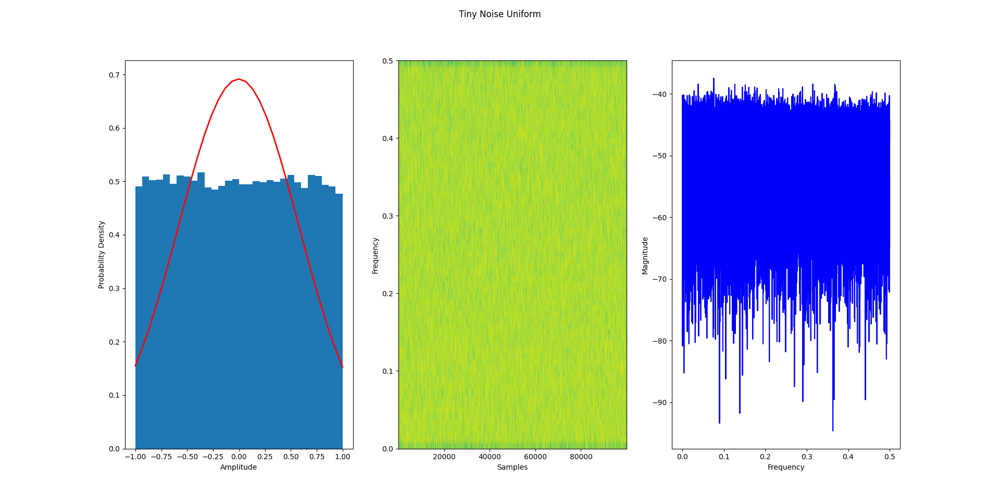
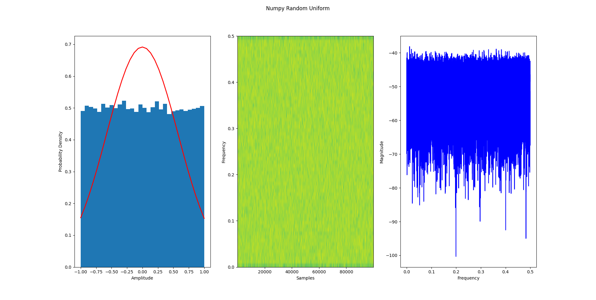

# TinyNoise

TinyNoise is an efficient stochastic noise generator written in C, based on pseudo random numbers, with a very small footprint.

**Are ready to hear the noise? It is so tiny...**

## Donations

I believe in **free and open source software**! Help the OSS community by donating below:

[](https://www.paypal.com/donate/?hosted_button_id=AMFZ83MA4Z3RA)

## Overview

### Features

* Computationally and memory efficient algorithm 
* No math library needed
* White, brown or pink noise available
* Unit-tested using Cmocka

### Pseudo Random Number Generator Algorithm

The algorithm described below was designed by me. It was an effort to create a fix point, low footprint stochastic noise generator for integration on a low power DSP chip. This signal was used, after filtering, for tinnitus treatment.

#### Implementation

Random number generation with 16 bit variable
* Using 3 seeds
* Just 2 counters
* Only one multiplication, two additions and one shift operation
* Only 10 bytes need for RAM

1. Take a seed using the counter to select it. The counter is increased by 1 every loop. Here is an example of 3 seeds:

```
seeds = [65321,12043,2769]

val = seeds[seed_counter] = 65321 = 1111111100101001
```

2. Square the current value to get twice the size (in this example, from 16 bit to 32 bit).

```
val = val * val = 11111110010100101011010010010001
```

3. Crop the current sample based on the gama factor. Gama, same as seed counter, gets updated by 1 every loop, being that the maximum is the number of bits, this case 16 bits (0 to 15).

```
11111110010100101011010010010001
|     gama=0    |
 |     gama=1    |
  |     gama=2    |
            ...
               |     gama=15    |
```

For **gama = 0**, the output value will be **1111111001010010** or **65106**.

4. Next step is to update the seeds. Update the seed by adding the current value to the next seed. Hence, the output will be even more likely to imitate random behaviour. 

```
seeds[seed_counter] = val + seeds[seed_counter + 1]
```

For **seed_counter = 0**:

```
seeds[0]= 65106 + 12043 = 11613 = 0010110101011101
```

Note that the value above overflew and there is no problem with it for this algorithm.

5. The final step is to add the previous sample to the output.

```
output = val + prev_val
prev_val = val
```

Update the previous sample value too. For the first loop, **prev_val** is initialized to zero.

#### Results

The algorithm above has a uniform distribution with flat spectral composition. The plot below shows the output of it for 100k samples:



For comparison, here is the output of Python's Numpy random uniform implementation:



## Usage

